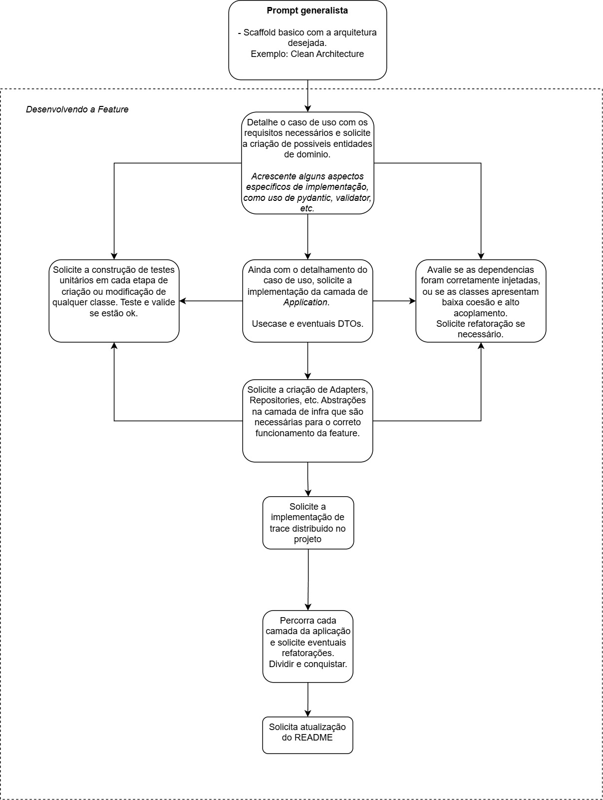

# AWS Python AI Prompts

Repositório com prompts para auxiliar no desenvolvimento de aplicações AWS Lambda e ECS usando Python, com foco em gerar código através de Inteligência Artificial.

## Sobre este Repositório

Este repositório contém templates de prompts projetados para trabalhar com assistentes de IA como Claude, ChatGPT ou Gemini, ajudando desenvolvedores a construir aplicações AWS com Python mais rapidamente. Utilizando estes prompts, você pode:

1. **Criar estruturas iniciais** de projetos com padrões arquiteturais como Clean Architecture
2. **Desenvolver componentes específicos** como entidades de domínio, casos de uso e gateways
3. **Implementar funções Lambda** para diversos cenários e padrões
4. **Escrever testes** unitários e de integração para seus componentes 
5. **Configurar observabilidade** e monitoramento
6. **Definir infraestrutura como código** com Terraform ou AWS CDK

## Estrutura do Repositório

```
aws-python-ai-prompts/
├── lambda/
│   ├── simple-patterns/         # Padrões simples para Lambdas pequenas
│   │   └── basic_lambda.md      # Template para Lambdas básicas
│   ├── medium-patterns/         # Padrões para Lambdas com lógica moderada
│   ├── complex-patterns/        # Arquiteturas para Lambdas complexas
│   └── specific-use-cases/      # Casos específicos (APIs, processadores, etc)
│       └── api_gateway_lambda.md # Template para APIs REST com Lambda/API Gateway
│
├── ecs/
│   ├── microservices/           # Padrões para microserviços no ECS
│   ├── web-apps/                # Aplicações web completas no ECS
│   └── batch-processing/        # Processamento em lote no ECS
│
├── prompt-templates/
│   ├── initial-scaffolding/     # Templates para estrutura inicial de projeto
│   │   ├── clean_architecture.md # Estrutura base com Clean Architecture
│   │   └── iac_lambda.md        # Infraestrutura como código para Lambda
│   │
│   ├── feature-implementation/  # Templates para implementação de features
│   │   ├── domain_entities.md   # Entidades de domínio
│   │   ├── use_case.md          # Casos de uso
│   │   ├── aws_gateway.md       # Gateways para serviços AWS
│   │   └── observability/       # Observabilidade
│   │       └── datadog.md       # Observabilidade com Datadog
│   │
│   └── testing/                 # Templates para testes
│       ├── unit_tests.md        # Testes unitários
│       ├── integration_tests.md # Testes de integração
│       └── lambda_tests.md      # Testes específicos para Lambdas
│
└── guides/                     # Guias e documentação
    └── best-practices.md       # Melhores práticas para prompts de IA
```

## Como Usar os Prompts

### Fluxo de Trabalho Sequencial

Os prompts foram projetados para serem usados em uma sequência lógica:

1. **Inicie com a estrutura de projeto** usando templates de *initial-scaffolding*
2. **Defina o domínio** com os prompts de *domain_entities.md*
3. **Implemente casos de uso** usando *use_case.md*
4. **Adicione gateways/repositórios** para serviços AWS usando *aws_gateway.md*
5. **Escreva testes** com os templates de testing
6. **Implemente observabilidade** com o template Datadog
7. **Defina infraestrutura** usando *iac_lambda.md*



### Exemplo de Diálogo com a IA

Para utilizar os prompts, copie o conteúdo do arquivo .md no assistente de IA e adapte conforme necessário:

```
[Você]: Preciso criar uma função AWS Lambda que processa mensagens SQS e salva dados em uma tabela DynamoDB.

[IA]: Posso ajudar com isso. Para criar essa função, vamos precisar definir a estrutura, código da função, 
     testes e infraestrutura. Vamos começar pela estrutura básica da função Lambda?

[Você]: Sim, por favor.

[Você]: *Cola o conteúdo de lambda/simple-patterns/basic_lambda.md adaptando campos conforme necessário*

[IA]: *Gera o código da função Lambda básica com a estrutura solicitada*

[Você]: Agora preciso de testes para essa função.

[Você]: *Cola o conteúdo de prompt-templates/testing/lambda_tests.md adaptando para sua função*

[IA]: *Gera os testes para a função Lambda*

[Você]: Agora preciso da infraestrutura como código usando Terraform.

[Você]: *Cola o conteúdo de prompt-templates/initial-scaffolding/iac_lambda.md adaptando para Terraform*

[IA]: *Gera o código Terraform para provisionar a função Lambda e recursos relacionados*
```

## Jornadas de Desenvolvimento

Para ajudar você a começar, aqui estão algumas jornadas completas de desenvolvimento:

### Jornada 1: Sistema de Processamento de Pedidos com Lambda + SQS + DynamoDB

1. Defina as entidades de domínio (Pedido, Item) usando `domain_entities.md`
2. Crie um caso de uso para processar pedidos usando `use_case.md`
3. Implemente o gateway DynamoDB com `aws_gateway.md`
4. Desenvolva a função Lambda usando `basic_lambda.md`
5. Adicione observabilidade com `datadog.md`
6. Escreva testes para a solução usando `lambda_tests.md`
7. Configure a infraestrutura com `iac_lambda.md`

### Jornada 2: API REST com Lambda + API Gateway

1. Defina a estrutura do projeto usando `clean_architecture.md`
2. Crie as entidades e DTOs com `domain_entities.md` 
3. Implemente os casos de uso da API usando `use_case.md`
4. Crie a função Lambda com API Gateway usando `api_gateway_lambda.md`
5. Implemente testes com `lambda_tests.md`
6. Configure a infraestrutura com `iac_lambda.md`

## Contribuições

Contribuições são bem-vindas! Sinta-se à vontade para:

1. Adicionar novos templates de prompts
2. Melhorar os prompts existentes
3. Criar novos guias ou exemplos de uso
4. Corrigir erros ou melhorar a documentação

## Recursos Adicionais

- [Documentação AWS Lambda](https://docs.aws.amazon.com/lambda/latest/dg/welcome.html)
- [Documentação AWS ECS](https://docs.aws.amazon.com/ecs/latest/developerguide/Welcome.html)
- [Terraform AWS Provider](https://registry.terraform.io/providers/hashicorp/aws/latest/docs)
